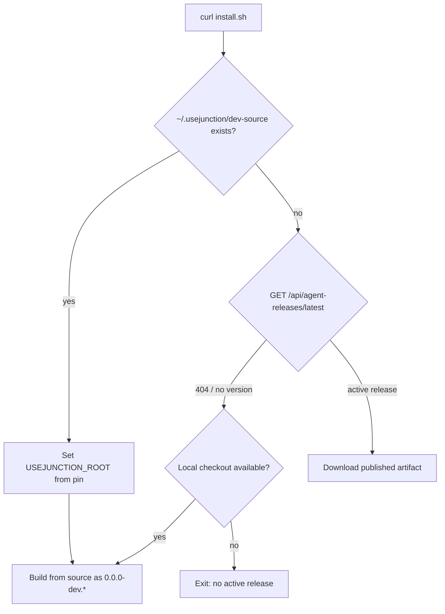

# Controlled Agent Releases

This document is the canonical guide for how UseJunction ships agent updates, how those updates reach devices, how coverage is measured, and how to work on the system in development.

For hosting the control plane on Vercel (env vars, DB migrations, crons), see [production-deployment.md](./production-deployment.md).

The key design goal is that release creation and release activation are separate events.

- Tagging creates an immutable candidate.
- Promotion activates a candidate into the fleet.
- Heartbeats deliver directives.
- Agent lifecycle events report what actually happened on the device.
- Confirmation only counts after the restarted daemon authenticates back to the control plane.

## Mental model

There are four layers to keep straight:

1. Candidate artifacts are produced by a tagged release build.
2. A release record in Postgres becomes active only after a protected promotion.
3. Each compatible enrolled device gets a fixed deployment row the moment the release activates.
4. The agent reports lifecycle milestones back as it downloads, installs, restarts, or rolls back.

This means the control plane knows both the intended rollout and the observed outcome.

## Release triggers

### 1. Candidate build trigger

Creating a semantic version tag that starts with `agent-v` builds an immutable release candidate.

Example:

```bash
git tag agent-v0.2.0
git push origin agent-v0.2.0
```

That push triggers `.github/workflows/agent-release-build.yml`.

The build workflow:

- validates the version string
- fails if the release already exists
- runs `go test ./...` in `agent/`
- requires signing secrets (`AGENT_UPDATE_TRUSTED_KEYS`, `AGENT_UPDATE_SIGNING_KEY_ID`, `AGENT_UPDATE_SIGNING_PRIVATE_KEY`)
- builds macOS, Linux, and Windows binaries for `amd64` and `arm64`
- injects the version and trusted public keys with Go linker flags
- packages macOS app bundles
- generates `checksums.txt`
- writes and **signs** a `manifest.json`
- publishes a draft GitHub Release

Important behavior:

- a merge to the default branch does not create a release
- a tag alone does not activate rollout
- the candidate artifacts are immutable
- unsigned manifests are rejected (build fails closed without signing secrets)
- if the tag must be corrected, the fix is a new version, not a tag rewrite
- **bootstrap caveat:** agents built before trusted keys were embedded cannot verify signed OTA manifests. Those devices must take one `install.sh --upgrade` (or reinstall) onto a key-bearing build; subsequent OTAs then work

### 2. Rollout trigger

Promotion is a separate protected action.

It uses `.github/workflows/agent-release-control.yml` with `workflow_dispatch` and the protected `agent-production` environment.

The promotion workflow:

- requires an authorized maintainer
- downloads the immutable candidate from GitHub Releases
- rewrites the manifest urgency to `normal` or `critical`
- sets rollout hours to `24` for normal or `0` for critical
- **re-signs** the manifest after urgency mutation (`scripts/sign-agent-release-manifest.js`)
- publishes the GitHub Release as non-draft
- calls the authenticated control-plane promotion endpoint

This is the point where the release becomes active for enrolled devices.

## Workflow summary

| Step | Trigger | Result |
|---|---|---|
| Candidate build | `git push origin agent-vX.Y.Z` | Draft candidate release + immutable artifacts |
| Promotion | `workflow_dispatch` with `action=promote` | Active rollout + fleet snapshot |
| Pause | `workflow_dispatch` with `action=pause` | Stop issuing new directives |

**A normal `git push` / merge to `main` does not update devices.** Only tag + promote does. Web app deploys are separate (Vercel); see [production-deployment.md](./production-deployment.md).

## Production secrets setup

One-time configuration for signing and promote. Do this before the first `agent-v*` tag.

### 1. Generate an Ed25519 signing keypair

```bash
SEED=$(openssl rand -hex 32)
KEY_ID="prod-1"
SEED="$SEED" KEY_ID="$KEY_ID" node <<'EOF'
const crypto = require("crypto");
const seed = Buffer.from(process.env.SEED, "hex");
const pkcs8 = Buffer.concat([
  Buffer.from("302e020100300506032b657004220420", "hex"),
  seed,
]);
const privateKey = crypto.createPrivateKey({ key: pkcs8, format: "der", type: "pkcs8" });
const publicKey = crypto.createPublicKey(privateKey);
const spki = publicKey.export({ type: "spki", format: "der" });
const pub = spki.subarray(-32).toString("base64url");
console.log("AGENT_UPDATE_SIGNING_PRIVATE_KEY=" + process.env.SEED);
console.log("AGENT_UPDATE_SIGNING_KEY_ID=" + process.env.KEY_ID);
console.log("AGENT_UPDATE_TRUSTED_KEYS=" + process.env.KEY_ID + ":" + pub);
EOF

openssl rand -base64 32   # AGENT_RELEASE_OPERATIONS_TOKEN
```

Store the values in a password manager. Never commit them. If a private key is pasted into chat or logs, rotate it.

Keep `KEY_ID` stable across releases unless you intentionally rotate keys. `AGENT_UPDATE_TRUSTED_KEYS` is a comma-separated list of `keyId:base64urlPublicKey` (usually one entry).

### 2. GitHub repository secrets (Actions → Secrets)

Used by `.github/workflows/agent-release-build.yml` (and re-sign on promote):

```bash
gh secret set AGENT_UPDATE_SIGNING_KEY_ID -b 'prod-1'
gh secret set AGENT_UPDATE_SIGNING_PRIVATE_KEY -b '<hex seed>'
gh secret set AGENT_UPDATE_TRUSTED_KEYS -b 'prod-1:<base64url public key>'
```

### 3. GitHub Environment `agent-production`

Create the environment (Settings → Environments, or API). Optionally enable **Required reviewers** so promote needs approval.

```bash
gh api -X PUT repos/<owner>/<repo>/environments/agent-production

gh secret set CONTROL_PLANE_URL \
  --env agent-production \
  -b 'https://usejunction.dev'

gh secret set CRON_SECRET \
  --env agent-production \
  -b '<same value as Vercel Production CRON_SECRET>'

gh secret set AGENT_RELEASE_OPERATIONS_TOKEN \
  --env agent-production \
  -b '<same token as Vercel>'
```

`.github/workflows/agent-release-control.yml` and `.github/workflows/production-crons.yml` run with `environment: agent-production`. Release control calls:

- `POST $CONTROL_PLANE_URL/api/internal/agent-releases/promote`
- `POST $CONTROL_PLANE_URL/api/internal/agent-releases/pause`

### 4. Vercel Production

Set the **same** `AGENT_RELEASE_OPERATIONS_TOKEN` on the `admin` project so the control plane accepts promote/pause. See [production-deployment.md](./production-deployment.md).

### Verify

```bash
gh secret list
gh secret list --env agent-production
```

## How to ship a production agent release

### Candidate (immutable build)

1. Ensure the commit you want is on the branch you will tag (usually `main`).
2. Choose a new semver that has never been tagged. Match or bump `agent/internal/config/config.go` `Version` as appropriate.
3. Tag and push:

```bash
git tag agent-v0.3.1
git push origin agent-v0.3.1
```

4. Wait for **Agent release candidate** to finish (`gh run watch` or the Actions UI). It creates a **draft** GitHub Release. Devices are not updated yet.

Do not rewrite tags. If the build is wrong, ship `agent-v0.3.2` (or the next version).

### Promote (activate fleet rollout)

**GitHub UI**

1. Actions → **Agent release control** → **Run workflow**
2. Inputs:
   - `action`: `promote`
   - `version`: `0.3.1` (no `agent-v` prefix)
   - `urgency`: `normal` (24h staggered rollout) or `critical` (immediate)
3. Approve the `agent-production` environment gate if configured.

**CLI**

```bash
gh workflow run agent-release-control.yml \
  -f action=promote \
  -f version=0.3.1 \
  -f urgency=normal
```

### Pause

```bash
gh workflow run agent-release-control.yml \
  -f action=pause \
  -f version=0.3.1 \
  -f urgency=normal
```

(`urgency` is unused for pause but required by the workflow inputs.)

### After promote

- Enrolled devices receive directives on heartbeat / update check.
- Coverage: `GET /api/agent-releases/:version/coverage` (org) or internal aggregate.
- Devices built **before** trusted signing keys were embedded need one manual bootstrap:

```bash
curl -fsSL https://usejunction.dev/install.sh | sh -s -- --upgrade --url https://usejunction.dev
```

Subsequent OTAs then verify signed manifests normally.

## Control plane API surface

The release system is backed by these routes:

- `POST /api/internal/agent-releases/promote`
- `POST /api/internal/agent-releases/pause`
- `GET /api/agent-releases/latest`
- `GET /api/agent-releases/:version/coverage`
- `GET /api/internal/agent-releases/:version/coverage`
- `POST /api/devices/heartbeat`
- `POST /api/devices/agent-update/check`
- `POST /api/devices/agent-update`

The public and internal routes intentionally differ:

- the org-scoped coverage route is for owners/admins
- the platform coverage route is for operations and uses `AGENT_RELEASE_OPERATIONS_TOKEN`
- device routes require the device bearer token

## Promotion behavior

Promotion creates or reuses an `agentRelease` record and snapshots the eligible fleet into `agentUpdateDeployment` rows with `cohortMember = true`.

Each rollout snapshot includes every compatible device enrolled at the moment promotion starts.

The snapshot uses the device’s current recorded OS, architecture, and agent version to decide whether it is compatible.

Devices already on the target version or a newer version are marked confirmed immediately.

Devices enrolled later (or whose OS/arch becomes known after promote) still receive OTA: heartbeat/enroll calls `ensureActiveReleaseDeployment`, which creates a row with `cohortMember = false` and immediate eligibility. Those devices are excluded from coverage denominators.

If the same version is promoted again:

- artifacts must match exactly
- the manifest may update urgency (control workflow **re-signs** after rewriting urgency/rolloutHours)
- the release remains immutable with respect to binary content
- the historical cohort does not expand to include devices that enrolled later

If urgency is escalated from normal to critical:

- the existing cohort is preserved
- unconfirmed devices become immediately eligible
- the rollout keeps the same release identity

## Heartbeat behavior

The heartbeat endpoint is the normal control-plane synchronization path for enrolled devices.

When the daemon calls `POST /api/devices/heartbeat` it sends:

- device identity metadata
- current OS and architecture
- current agent version
- optional local sync metadata

The server then:

- updates `lastSeenAt`
- records the most recent agent metadata
- checks whether an update directive should be returned

If a directive is returned, it includes:

- `releaseId`
- `attemptId`
- `targetVersion`
- `urgency`
- `artifactUrl`
- `sha256`
- `size`
- `eligibleAt`

The heartbeat response is intentionally tolerant:

- if update persistence fails, the heartbeat still succeeds
- if directive generation fails, the heartbeat still succeeds
- older agents safely ignore the extra response field

## Update lifecycle

The update lifecycle is recorded as append-only events plus a deployment state.

Supported lifecycle events:

| Event | Meaning |
|---|---|
| `download_started` | The agent began fetching the artifact |
| `download_completed` | The artifact finished downloading and passed size verification |
| `install_started` | The agent began the atomic replacement |
| `install_failed` | Download, verification, or replacement failed |
| `install_confirmed` | The new daemon started and authenticated back |
| `rollback_started` | The agent began restoring the previous binary |
| `rollback_confirmed` | The previous binary was restored and confirmed |

Rules worth remembering:

- download completion is not success
- install start is not success
- success only counts after the restarted daemon authenticates with the target version
- heartbeat version confirmation can also close the loop if the installed version matches the target
- retries are idempotent through `eventId`

## Device update API

Agents report lifecycle milestones with:

`POST /api/devices/agent-update`

The body includes:

- `attemptId`
- `eventId`
- `releaseVersion`
- `event`
- `currentVersion`
- `targetVersion`
- optional sanitized `stage`
- optional sanitized `errorCode`

The server enforces ownership through the device bearer token.

That means:

- a device can only report for itself
- a device cannot submit metrics for another release attempt
- duplicate event IDs are deduplicated safely
- out-of-order events do not corrupt the state machine

There is also a direct check endpoint:

`POST /api/devices/agent-update/check`

That endpoint bypasses rollout eligibility and is used by the manual `update --check` flow.

## Agent-side update flow

The Go agent updater is responsible for the local mechanics of:

- checking whether a newer version exists
- downloading the artifact
- verifying the signed manifest and trusted key id
- verifying the size limit
- verifying the SHA-256 checksum
- writing pending-update state before replacement
- replacing the binary atomically
- preserving the previous binary as `.previous`
- reporting lifecycle milestones back to the control plane
- explicitly restarting the background service (launchctl/systemctl; Windows handoff)
- confirming the restart

Local safety rules:

- invalid semantic versions are rejected
- downgrades are rejected
- artifacts larger than 100 MiB are rejected
- checksum mismatches abort the install
- the current daemon keeps running on failure
- a rolled-back version is blocked locally until a newer release arrives or the operator uses `--force`

## Bootstrap and rollback

`install.sh` and `install.ps1` support two main paths:

- enrollment with `--token`
- upgrade-only bootstrap with `--upgrade`

PowerShell uses the equivalent `-Token`, `-Url`, and `-Upgrade` parameters. It installs `usejunction.exe` for the current user and registers the `UseJunction Agent` logon task without elevation.

For upgrades, the script:

- reads the current active release from `/api/agent-releases/latest`
- downloads from the control plane release mirror first
- falls back to the GitHub release if needed
- verifies checksums before use
- can build from source when the repo is present locally

Rollback is handled by the agent CLI:

```bash
usejunction update --rollback
```

That restores the retained binary, restarts the service, and reports rollback confirmation.

## Install script behavior (prod vs dev)

`install.sh` chooses between **downloading a published release** and **building from a local checkout**. The `--url` flag only selects which control plane to enroll against; it does **not** by itself force a production binary.

### Decision flow



1. **Check for a dev pin** — If `~/.usejunction/dev-source` exists and points at a repo with `agent/main.go`, the installer sets `USEJUNCTION_ROOT` and builds from that checkout.
2. **Check the control plane** — `GET /api/agent-releases/latest` must return an active or superseded release. The installer parses `manifest.version` from the JSON response.
3. **Prefer source when pinned** — A pinned checkout always rebuilds locally; it never silently downloads a published release over your working tree.
4. **Download only when published** — If step 2 succeeds and no dev pin forces a source build, the installer downloads the artifact advertised by the control plane (control-plane mirror first, GitHub fallback). It does **not** guess a version from GitHub when the control plane has no active release.

Quick check:

```bash
curl -fsSL https://usejunction.dev/api/agent-releases/latest
# 200 + manifest.version → customer install path is ready
# 404 {"error":"no active release"} → promote a release first (see below)
```

### Local dev builds (`0.0.0-dev.*`)

When the installer builds from source it stamps:

```text
0.0.0-dev.<git-short-sha>.<unix-timestamp>
```

This is intentional:

- Published semver (`0.3.7`) sorts above `0.0.0-dev.*`, so OTA would otherwise overwrite a developer’s local build on the next heartbeat.
- The agent updater refuses OTA over `0.0.0-dev.*` binaries (`ErrLocalDevPinned`).
- The control plane treats dev versions as compatible for local work but they are not fleet releases.

**What creates the dev pin**

| Action | Effect |
|--------|--------|
| `pnpm agent:reinstall` / `scripts/dev-agent-reinstall.sh` | Rebuilds from repo, writes `~/.usejunction/dev-source` |
| `install.sh` with `USEJUNCTION_ROOT` set | Same: source build + dev pin |
| Prior source-based install | Pin persists across later `curl \| sh` runs |

**Symptom:** Install against `https://usejunction.dev` still prints `Building agent from source … as v0.0.0-dev.…` and `Using pinned local checkout from ~/.usejunction/dev-source`.

**Cause:** This machine is in developer mode, not customer mode. The control plane URL does not override the pin.

**To switch back to a published release on this machine:**

```bash
rm ~/.usejunction/dev-source
USEJUNCTION_FORCE_RELEASE=1 curl -fsSL https://usejunction.dev/install.sh | sh -s -- --token <token> --url https://usejunction.dev
```

`USEJUNCTION_FORCE_RELEASE=1` is required if a `0.0.0-dev.*` binary is already installed; otherwise the installer keeps the existing dev binary.

### Production install requires promotion, not just a GitHub tag

Customer installs on `https://usejunction.dev` need an **active** `agentRelease` row in Postgres. Tagging `agent-vX.Y.Z` only creates an immutable **candidate** on GitHub Releases; **promotion** is a separate protected step that calls `POST /api/internal/agent-releases/promote`.

| State | GitHub Releases | `/api/agent-releases/latest` | `curl …/install.sh` on prod |
|-------|-----------------|------------------------------|-----------------------------|
| Tag pushed, draft candidate | Artifacts exist (may be draft) | 404 | Fails unless local checkout pinned |
| Promoted | Published + signed manifest | 200 with `manifest.version` | Downloads published binary |
| Paused on control plane | May still exist on GitHub | 404 (paused excluded) | Fails unless local checkout |

**Symptom:**

```text
No active agent release is published on https://usejunction.dev, and no local checkout was available to build from.
```

**Cause:** No release has been promoted (or the active release was paused). A `agent-v*` tag on GitHub alone is not enough.

**Fix (operators):**

```bash
gh workflow run agent-release-control.yml \
  -f action=promote \
  -f version=0.3.7 \
  -f urgency=normal
```

Then verify:

```bash
curl -fsSL https://usejunction.dev/api/agent-releases/latest | jq .manifest.version
```

**Fix (developer on this machine, before promotion):**

```bash
USEJUNCTION_ROOT=/path/to/usejunction curl -fsSL https://usejunction.dev/install.sh | sh -s -- --token <token> --url https://usejunction.dev
# or, after enroll: pnpm agent:reinstall
```

### Environment overrides

| Variable | Effect |
|----------|--------|
| `USEJUNCTION_ROOT` | Force build from this monorepo checkout |
| `USEJUNCTION_BUILD_FROM_SOURCE=1` | Prefer source build when possible |
| `USEJUNCTION_FORCE_RELEASE=1` | Download published release even if a `0.0.0-dev.*` binary is installed |
| `USEJUNCTION_URL` / `--url` | Control plane base URL for enroll and release lookup (default local: `http://localhost:3001`) |

## Coverage model

Coverage is defined against the release-time cohort (`cohortMember = true`).

That denominator includes every compatible device enrolled when the release activated.

Devices enrolled after activation (or attached after OS/arch correction) still receive update directives via non-cohort deployment rows, but they are excluded from coverage percentages.

Per release, the control plane tracks:

- total cohort devices
- currently eligible
- directive delivered
- downloaded
- install attempted
- successfully installed and confirmed
- failed
- rolled back
- pending, awaiting a future heartbeat

Primary ratios:

- pull coverage = downloaded / total cohort
- confirmed installation coverage = confirmed / total cohort
- download-to-install conversion = confirmed / downloaded
- failure rate = failed and unconfirmed / attempted

The per-organization coverage UI is exposed on the Team page and reads from:

- `GET /api/agent-releases/:version/coverage`

The platform aggregate view is exposed through:

- `GET /api/internal/agent-releases/:version/coverage`

## Release states

The release record supports these operational states:

- `active`
- `superseded`
- `paused`

State transitions are intentionally conservative:

- a newer active release supersedes the previous active release
- pause stops future directives immediately
- pause does not uninstall already updated devices
- broken releases are replaced by newer versions instead of a fleet-wide downgrade

## Development workflow

There are two different local loops. Do not confuse them.

### Two agents on one machine

| Profile | Home | CLI | Service |
|---------|------|-----|---------|
| `default` | `~/.usejunction` | `usejunction` | `com.usejunction.agent` |
| `test` | `~/.usejunction-test` | `usejunction-test` | `com.usejunction.agent.test` |

Loopback installs (`http://localhost:3001`) auto-select the **test** profile so local dev never overwrites production enrollment. Both agents can run concurrently (separate config, launchd job, and local-sync port `47833` for test).

**Cursor usage-events cache:** Cursor billed-event aggregates are cached under each profile’s `cache/cost-usage/cursor-usage-events.json` (via `config.CacheDir()`). Test and default agents must **not** share a cache path — a stale shared file was a source of `$0 verified_usage` rows on sync.

**Fleet rematerialize after pricing fixes:** When an agent release changes Cursor cost semantics (rate card / `chargedCents=0` → `estimated_api`), promote the release then bump `fullUsageRescanDay` on the control plane (daily cron [`usage-daily-refresh`](./usage-daily-refresh) or `setFullUsageRescanDay`) so enrolled devices run a forced full usage collect on the next heartbeat. Devices OTA to the new binary rebuild Cursor events and upload `estimated_api` rows; dashboards rematerialize from agent uploads (no per-machine reinstall required for fleet users).

**Recovery:** If production stopped receiving heartbeats because you enrolled locally against the wrong home, re-enroll production from your hosted control plane into `~/.usejunction` while keeping the test agent in `~/.usejunction-test`.

### Agent feature work (hot reload)

When you are changing agent behavior on your machine, swap the local binary directly. Do **not** use tagged releases for this loop.

```bash
# enroll test agent once (if needed)
./install.sh --token <token> --url http://localhost:3001

# one-shot rebuild into ~/.usejunction-test and restart the daemon
pnpm agent:reinstall

# or watch agent/ and reinstall on each change
pnpm dev:agent
```

Hot reload:

- builds from this checkout with a `0.0.0-dev.<sha>.<unix>` version stamp
- packages/swaps into `~/.usejunction-test` and restarts launchd/systemd (`com.usejunction.agent.test`)
- keeps the existing test enrollment
- does **not** create a GitHub Release, promote a fleet rollout, or update `/api/agent-releases/latest`

Set `USEJUNCTION_PROFILE=default` on `dev-agent-reinstall.sh` / `dev-agent-watch.sh` to target the production agent home instead.

Scripts: [scripts/dev-agent-reinstall.sh](../scripts/dev-agent-reinstall.sh), [scripts/dev-agent-watch.sh](../scripts/dev-agent-watch.sh).

Optional: install `fswatch` (`brew install fswatch`) so the watcher reacts to filesystem events instead of polling.

### Release system work (candidate + promote)

If you are working on the release system itself, this is the shortest useful loop:

1. Run the backend and agent tests.
2. Build a tagged candidate locally.
3. Promote the candidate through the protected control-plane workflow.
4. Verify the heartbeat, directive, download, install, and confirmation path.

Helpful commands:

```bash
# backend and UI tests
pnpm test

# Go agent tests
cd agent && go test ./...

# build an immutable candidate into apps/admin/public/releases/download/vX.Y.Z
./scripts/build-agent-releases.sh 0.2.0

# release bootstrap / upgrade
curl -fsSL <control-plane>/install.sh | sh -s -- --upgrade --url <control-plane>
```

If you are changing the release control plane, the most important files are:

- [apps/admin/lib/agent-updates/contracts.ts](../apps/admin/lib/agent-updates/contracts.ts)
- [apps/admin/lib/agent-updates/service.ts](../apps/admin/lib/agent-updates/service.ts)
- [apps/admin/app/api/devices/heartbeat/route.ts](../apps/admin/app/api/devices/heartbeat/route.ts)
- [apps/admin/app/api/devices/agent-update/route.ts](../apps/admin/app/api/devices/agent-update/route.ts)
- [apps/admin/app/api/internal/agent-releases/promote/route.ts](../apps/admin/app/api/internal/agent-releases/promote/route.ts)
- [agent/internal/updater/updater.go](../agent/internal/updater/updater.go)
- [agent/cmd/update.go](../agent/cmd/update.go)
- [.github/workflows/agent-release-build.yml](../.github/workflows/agent-release-build.yml)
- [.github/workflows/agent-release-control.yml](../.github/workflows/agent-release-control.yml)

## Feature-gated agent updates (work extraction)

Some user-facing features require a minimum agent version. Work extraction is the first:

- Minimum version: `0.3.1` (`WORK_EXTRACTION_MIN_AGENT_VERSION` / agent `workextract.MinAgentVersion`) — enforces the server-authoritative forward-only collection epoch
- When an admin turns **Work extraction** on under Settings → Signals, the control plane calls `accelerateOrgAgentRollout(orgId)` for that workspace only
- Pending deployments on the **active** release for that org become immediately eligible (`eligibleAt = now`)
- Other orgs keep their staggered rollout schedule
- Updated agents use the later of workspace enablement and device enrollment as their collection boundary. Existing local history is not imported; post-boundary observations may upload on a later heartbeat, then advance `workExtractionLastAt` incrementally
- Work extraction does **not** require classic app/domain collection (`enabled`) to be on
- Background collect also delta-uploads local usage via the sync-engine session (server `DeviceUsageFingerprint` partitions); first sync raises the per-pass batch budget so ~1k partitions drain quickly.

Ops still must promote the forward-only work extraction release (`agent-v0.3.1` or later) before devices can download a compatible binary. Enabling the setting cannot invent artifacts.

Release progress is measured only via Team → Agent update coverage (fixed cohort metrics), not a separate Settings readiness strip.

## Phase 2 reserve: classic Signals + browser extension

Classic app/domain journeys and browser-extension domain enrichment are reserved for a later OTA:

- Placeholder min version: `0.4.0` (`CLASSIC_SIGNALS_MIN_AGENT_VERSION` on the control plane)
- Policy flag remains `SignalsPolicy.enabled` (independent of work extraction)
- When that release ships: gate effective classic collection on `enabled && agentVersion >= min`, call `accelerateOrgAgentRollout` on enable, and surface rollout progress via Team → Agent update coverage
- Browser extension: keep the session model stable; implement `BrowserContextProvider` via native messaging (today: `NoopBrowserContextProvider`). Extension install is separate from agent OTA; if a native-messaging host must live in the agent, ship it as a normal agent release (same promote/heartbeat updater)
- Product UI until then: Overview / Journeys / Tools are demoted or marked “later update” when classic is off

## Future macOS menu bar companion

A tiny macOS menu bar UI may ship in a later agent release. It is **not** required for agent function today.

Contract when that release ships:

- **macOS-only companion.** Linux stays headless. No Windows agent path.
- **Daemon remains launchd-owned.** `~/Library/LaunchAgents/com.usejunction.agent.plist` continues to run `…/UseJunction.app/Contents/MacOS/usejunction daemon`. The menu bar does not own KeepAlive or collection.
- **Tray talks to existing local APIs.** Status and “Sync now” use loopback localsync HTTP (`127.0.0.1`, default port from config) plus `~/.usejunction/config.json` (token/port). No new IPC channel.
- **Bundle layout.** Optional second binary at `Contents/MacOS/UseJunctionMenu` beside `usejunction`. Packaging already accepts `USEJUNCTION_MENU_BINARY` or a 4th arg to `scripts/package-macos-app.sh` when that binary exists.
- **Delivery via auto-update, not reinstall.** Existing enrolled Macs should get the tray from a normal agent release. The first menu-bar-bearing release must:
  1. Change Darwin update artifacts from a bare Mach-O to a multi-file bundle (`.app.zip` or Contents archive) that includes `usejunction`, `UseJunctionMenu`, and updated `Info.plist`.
  2. Enhance Darwin `updater.Apply` for multi-file replace + rollback snapshot (Linux stays single-binary).
  3. After `launchctl kickstart`, one-shot open/register the tray (`SMAppService` or `open`) so users see it without re-running `install.sh`.
- **Minimum OS for that release:** macOS 14+.

Until then, update artifacts remain bare Darwin binaries and `Apply` continues to replace a single executable.

## Operational notes

- The 15-minute heartbeat remains the normal delivery path.
- The 30-minute collect tick rescans local tools; usage and work uploads stay incremental (fingerprints + watermark).
- Automatic update support is enabled by default.
- macOS and Linux are the supported platforms for the first rollout.
- The control-plane operations token must never be shipped to agents.
- Release summaries and lifecycle events are retained as audit history.

## Troubleshooting

If a rollout appears stuck, check these layers in order:

1. Is the release active or paused?
2. Did the device join the cohort before activation?
3. Is the device compatible with the release artifact for its OS and architecture?
4. Has the next heartbeat occurred?
5. Did the agent report `download_started`, `download_completed`, or `install_confirmed`?
6. Is the version blocked locally after a rollback?

Common failure modes:

- tag exists but no release is active yet
- release exists but was never promoted
- the device has not sent its next heartbeat yet
- device architecture does not match a published artifact
- checksum validation failed on the agent
- the agent was rolled back and the version is locally blocked

### Install-specific failures

| Symptom | Likely cause | Fix |
|---------|--------------|-----|
| `Building agent … as v0.0.0-dev.…` against prod URL | `~/.usejunction/dev-source` pin from `pnpm agent:reinstall` or prior source install | Expected for dev; remove pin + `USEJUNCTION_FORCE_RELEASE=1` for a fleet binary |
| `No active agent release is published on …` | `/api/agent-releases/latest` returns 404 — nothing promoted (or release paused) | Run **Agent release control** promote workflow; confirm with `curl …/api/agent-releases/latest` |
| Install worked locally (`localhost:3001`) but fails on prod | Local admin injects `USEJUNCTION_ROOT`; prod has no promoted release | Promote a release for prod customers; use `USEJUNCTION_ROOT` for pre-promote dev enroll |
| GitHub shows `agent-v0.3.7` but install still fails | Tag ≠ activation; installer trusts control plane, not GitHub alone | Promote that version to the control plane |

See [Install script behavior (prod vs dev)](#install-script-behavior-prod-vs-dev) for the full decision flow.
