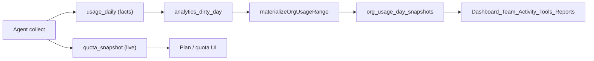

# Dashboard Snapshots

How the dashboard reads usage KPIs, when those snapshots refresh, and how quota sync relates to usage upload.

Related docs: [Central Analytics Engine](central-analytics-engine.md), [Tool Sync Methodology](tool-sync-methodology.md), [Usage Accounting](usage-accounting.md).

## Short answer

**Yes — all workspace usage surfaces load from sealed `org_usage_day_snapshots`, not live `usage_daily` queries.**

Dirty days are flagged as `partialData` / `dashboardReady: false`. Pages do **not** overlay live CTE results on top of stale snapshots while materialization catches up, and they never rematerialize inline on the read path.

Quota cards are a separate path: they read live `quota_snapshot` rows updated at sync **start**, and never touch usage day snapshots.



---

## What reads snapshots vs live data

| Surface | Data source | Notes |
|---------|-------------|-------|
| Team dashboard KPIs, trends, tools | `org_usage_day_snapshots` via `readOrgUsageFromSnapshots` | Dirty days → `partialData: true` |
| Personal / You dashboard (KPIs, models, productivity) | `readDeveloperUsageFromSnapshots` | Includes model + productivity measures |
| Activity (team) | `getDashboardUsage` → org snapshots | Models / by-day / by-tool from sealed grains |
| Team roster activity | `readDeveloperActivityFromSnapshots` | Developer + developer×tool grains |
| Tools list / tool detail | Tool + model snapshot grains | Quotas stay on `quota_snapshot` |
| Plan utilization billing lines | Developer×tool snapshots mapped via catalog | No live billing-facts CTE on page path |
| Activity report subjects | Org/dev day+tool snapshots | `daily_report_usage_snapshots` remains for sealed send payloads |
| Quota cards | `quota_snapshot` via `readQuotas` | Always live |
| `/api/insights/query` | Live `usage_daily` CTE | Debug / ad-hoc escape hatch only |

Snapshot grains (`org-day-snap-v2`):

| Grain | `developerId` | `toolName` | `modelName` |
|-------|---------------|------------|-------------|
| Org day | `""` | `""` | `""` |
| Org tool | `""` | tool | `""` |
| Developer day | id | `""` | `""` |
| Developer tool | id | tool | `""` |
| Org tool×model | `""` | tool | model |
| Developer tool×model | id | tool | model |

Measures per row: requests, sessions, input/output/cache/reasoning tokens, suggested/accepted/added/deleted lines, commits, verified/estimated/actual spend micros.

Key read-path contract (`apps/admin/lib/analytics/snapshots/read.ts`):

> Dirty days are reported as importing/partial — never recomputed via live CTEs. Default `ensure: false` on page readers.

After a snapshot version bump, cron / Sync now rematerialize fills new grains before model/productivity fields appear.

---

## Two freshness signals

The UI distinguishes **upload complete** from **dashboard ready**:

| Signal | Meaning | Source |
|--------|---------|--------|
| `lastUsageSyncAt` | This device finished uploading usage to the server | `device.lastUsageSyncAt` |
| `dashboardReady` | Sealed snapshots cover the visible window with no dirty days or stub conflicts | `getDashboardReadiness` |

A device can show "Last synced" while `dirtyDayCount > 0` — facts landed in `usage_daily`, but org-day snapshots have not been rematerialized yet. The sync panel calls `POST /api/app/dashboard/refresh-snapshots` in a loop until `dirtyRemaining === 0`.

---

## 1. When do snapshots actually refresh?

Snapshots refresh during **materialization**: a CTE over `usage_daily` writes sealed rows into `org_usage_day_snapshots` and clears matching `analytics_dirty_day` rows.

### Invalidation (mark dirty)

`invalidateAnalyticsCache` (`apps/admin/lib/analytics/query/invalidation.ts`) is the entry point:

1. `markOrgUsageDaysDirty` — insert into `analytics_dirty_day` (deduped)
2. `enqueueMaterializationJob` — watermark `status: pending`
3. Optionally inline-rematerialize (≤7 dirty days, 5 s debounce per org)

### Materialization triggers

| Trigger | When | Inline rematerialize? |
|---------|------|----------------------|
| **Usage sync chunk** | Each chunk POST | No — `rematerialize: false`; mark dirty only |
| **Usage sync commit** | Session commit (or partial commit) | Yes — `settleSyncProjections` → `materializeOrgNow` |
| **Empty-delta sync start** | Reconcile dirtied days | Yes — `settleSyncProjections` on start |
| **OTEL / invoice / integration import** | After facts written | Auto when dirty set ≤ 7 days |
| **Manual "Sync now" drain** | `POST /api/app/dashboard/refresh-snapshots` | Yes |
| **Daily cron `usage-daily-refresh`** | `15 0 * * *` UTC | Queue drain — up to 80 jobs / 45 s |
| **Daily cron `materialize-org-day-snapshots`** | `45 0 * * *` UTC | Up to 100 dirty + 100 active orgs |
| **Calculation / pricing version bump** | Deploy | `enqueueVersionBumpRematerialize` for all orgs |
| **Read-path corruption detect** | `ensureOrgUsageDaySnapshots` finds stub conflicts | Mark dirty + enqueue only (never inline) |

### Sync pipeline timeline

For a normal multi-chunk usage upload:

```text
start  → quotas/tools/accounts sidecars applied (no snapshot invalidation)
chunk1 → usage_daily updated, affected days marked dirty, snapshots still stale
chunk2 → same
...
commit → settleSyncProjections → rematerializeOrgSnapshots → snapshots fresh
```

`settleSyncProjections` always marks yesterday + today dirty before draining, so rolling windows advance even when only historical partitions changed.

### Materialization mechanics

- `materializeOrgUsageRange` — delete + re-insert snapshot rows for a date range
- Chunked in **14-day** windows (`MATERIALIZE_CHUNK_DAYS`)
- Per-org serialization: in-process lock + Postgres advisory lock
- `rematerializeOrgSnapshots` loops up to **20 passes × 90 dirty days** (1,800-day safety cap per settle)
- Returns `dirtyRemaining` when backlog exceeds one settle pass — cron and manual refresh drain the rest

### Read-path ensure (not a refresh)

On page load, readers use `ensure: false` by default. Optional `ensureOrgUsageDaySnapshots` may insert zero stubs for empty calendar days or mark corrupt sealed days dirty and enqueue the worker. It does **not** rematerialize on read — sync commit and cron own freshness.

---

## 2. Quota sync vs usage uploaded chunk-by-chunk

Quota sync and usage upload are **decoupled** inside the same UUS session.

### Agent

`UploadUsageSession` (`agent/internal/syncengine/upload.go`):

1. **Start** — manifest + inventory sidecars (tools, accounts, **quotas**)
2. **Chunks** — usage partitions (200 rows/batch, up to 4 concurrent POSTs)
3. **Commit** — finalize session

Quotas ride on **start only** (`agent/cmd/collect.go` — "Tools/accounts/quotas ride as sidecars on usage sync start").

### Server — quota path

On `startUsageSync` (`apps/admin/lib/sync/usage-sync.ts`):

- Compare `quotasContentHash` on the device
- If changed → `applyDeviceQuotaInventory` → upsert `quota_snapshot`, set `lastQuotasSyncAt`
- May trigger `syncDetectedPlansForDevice` + `repairDetectedPlanCycles`
- **Does not** call `invalidateAnalyticsCache` or mark usage snapshot days dirty

Quota cards update on the next page load after sync **start**, independent of chunk progress or commit.

### Server — usage chunk path

On each `ingestUsageSyncChunk`:

```ts
await invalidateAnalyticsCache(orgId, {
  dirtyDates,
  rematerialize: false,  // facts only; commit owns settle
});
```

| Phase | `usage_daily` | `analytics_dirty_day` | `org_usage_day_snapshots` | Dashboard KPIs | Quota cards |
|-------|---------------|----------------------|---------------------------|----------------|-------------|
| Sync start | — | — | unchanged | unchanged | **Updated** if hash changed |
| Chunk 1..N | updated | affected days dirty | **stale** (last seal) | stale + `partialData` | already updated |
| Commit | final | cleared after materialize | **refreshed** | up to date | unchanged since start |
| Partial commit | partial facts | settled anyway | improved | may still be partial | unchanged since start |

Partial commits still call `settleSyncProjections` so the dashboard improves while the agent continues uploading remaining partitions.

---

## 3. Many team members syncing on staggered schedules

### Agent cadence (clarification on "every 15 minutes")

From `agent/cmd/report.go`:

| Event | Interval | What it does |
|-------|----------|--------------|
| Heartbeat | 15 min | Liveness, OTA, collect-status forwarding |
| Scheduled collect | 30 min | Actual local scan + UUS upload (usage + quotas) |
| On-demand sync | User-triggered | Dashboard → loopback `127.0.0.1` collect |

So members are **not** uploading usage every 15 minutes by default — they heartbeat every 15 min and collect every 30 min. Quotas still only change when a collect session **starts** (at most once per collect, hash-gated).

### Per-org contention

All devices in one org share:

- One `analytics_dirty_day` set (deduped by org + date)
- One materialization lock per org
- One `settleSyncProjections` queue entry

```text
Member 1 commit ──┐
Member 2 commit ──┼──► mark dirty (deduped) ──► materializeOrgNow (serialized per org)
Member N commit ──┘
```

### At ~100 members

| Concern | Behavior |
|---------|----------|
| Duplicate dirty marks | Harmless — `skipDuplicates` on `analytics_dirty_day` |
| Materialize storms | Per-org lock serializes; later commits may find days already clean |
| Dashboard freshness | Bounded by slowest materialize pass; `snapshotLagSeconds` tracks oldest dirty day |
| Quota cards | Each device's sync start can update `quota_snapshot` (hash-gated); cheap upserts, no snapshot work |
| Activity drill-down | Live `usage_daily` — no snapshot lag |
| Backlog overflow | `dirtyRemaining > 0` after settle; cron (`usage-daily-refresh`, `materialize-org-day-snapshots`) and sync-panel drain loop catch up |

### Upload throughput per collect

From `agent/internal/scan/usage_upload.go`:

| Constant | Value |
|----------|-------|
| `UsageUploadBatchSize` | 200 rows/chunk |
| `UsageUploadMaxBatchesPerSync` | 8 (steady) / 10 (first or force-full) |
| `UsageUploadConcurrency` | 4 parallel chunk POSTs |

Collect loops up to 32 sync iterations to drain remaining rows. With 100 members on independent 30-minute clocks, expect ~3–4 commits/minute org-wide in the steady state (staggered), each triggering one settle attempt serialized per org.

### Cron safety net

- `usage-daily-refresh` — seals UTC day for agent full rescans, marks active orgs dirty, drains up to 80 materialization jobs in 45 s
- `materialize-org-day-snapshots` — rematerializes up to 100 dirty + 100 recently active orgs

These absorb backlog when inline settle cannot keep up during large backfills or version bumps.

---

## Key implementation files

| File | Role |
|------|------|
| `apps/admin/lib/analytics/snapshots/read.ts` | Dashboard read path (`readOrgUsageFromSnapshots`, `readDeveloperUsageFromSnapshots`) |
| `apps/admin/lib/analytics/snapshots/readiness.ts` | `getDashboardReadiness` freshness contract |
| `apps/admin/lib/analytics/snapshots/materialize.ts` | CTE materialize, `rematerializeOrgSnapshots` |
| `apps/admin/lib/analytics/snapshots/jobs.ts` | `materializeOrgNow`, `drainMaterializationJobs` |
| `apps/admin/lib/analytics/snapshots/overlay.ts` | Dirty-day helpers; live CTEs for rematerialize only |
| `apps/admin/lib/analytics/query/invalidation.ts` | `invalidateAnalyticsCache` |
| `apps/admin/lib/sync/usage-sync.ts` | UUS session; chunk dirty-mark; commit settle |
| `apps/admin/lib/sync/quotas-inventory.ts` | Quota sidecar apply (no snapshot invalidation) |
| `apps/admin/lib/insights/readers/quotas.ts` | Live quota reads for plan UI |
| `apps/admin/components/dashboard/local-sync-panel.tsx` | Sync progress + snapshot drain loop |
| `apps/admin/app/api/app/dashboard/refresh-snapshots/route.ts` | Manual rematerialize endpoint |
| `agent/internal/syncengine/upload.go` | Agent UUS orchestration |
| `agent/cmd/collect.go` | Quota sidecar on sync start |
| `agent/cmd/report.go` | 15 min heartbeat / 30 min collect scheduling |
