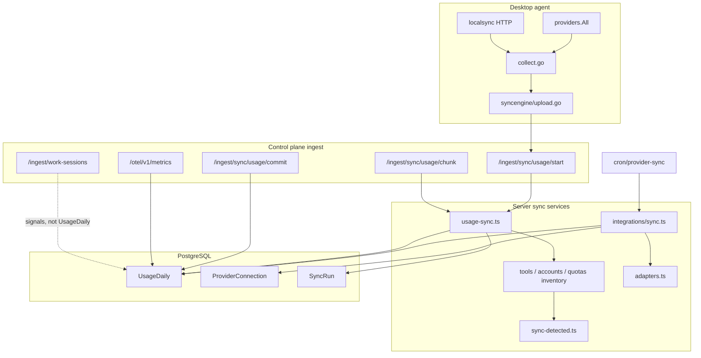

# Tool Sync Methodology

How UseJunction collects, transports, and reconciles usage and inventory data for every supported AI coding tool.

This document is the canonical overview. For wire formats and accounting semantics, see [Usage Schema v1](usage-schema-v1.md) and [Usage Accounting Contract](usage-accounting.md). For agent scheduling and on-demand sync, see [Controlled Agent Releases](agent-releases.md). For work/activity signals (separate pipeline), see [Signals Collection](signals-collection.md).

## Overview

UseJunction does **not** use a single sync pipeline. Data arrives through four independent paths that all land in `UsageDaily` (and related inventory tables) with source-aware priority:

| Path | Mechanism | Typical source | Who sets it up |
|------|-----------|----------------|----------------|
| **Device local sync** | Agent polls local tool storage → UUS session upload | `device_observed` / `estimated` | Enrolled desktop agent |
| **Cloud provider sync** | Control plane polls vendor admin APIs | `vendor_verified` | Org admin (Integrations) |
| **OTEL push** | Claude Code telemetry pushed to control plane | `otel_observed` | Agent + telemetry endpoint |
| **Manual import** | CSV/JSON invoice upload | `invoice_imported` | Org admin |

There are **no vendor webhooks** for tool usage. Billing webhooks (Lemon Squeezy) reconcile subscription seats only — not per-tool usage.

## Catalog tools

The product catalog (`apps/admin/lib/tools/catalog.ts`) defines six billing surfaces. Each maps to one or more agent provider IDs and optional cloud integrations.

| Catalog key | Agent ID(s) | Cloud integration | Primary sync path |
|-------------|-------------|-------------------|-------------------|
| `chatgpt-codex` | `codex` | OpenAI API Platform (`openai/api_platform`) | Device local JSONL |
| `claude` | `claude` | Anthropic API Platform + Enterprise (`anthropic/api_platform`, `anthropic/enterprise`) | Device local JSONL + OTEL |
| `cursor` | `cursor` | Cursor Teams (`cursor/teams`) | Device local SQLite + vendor events |
| `antigravity` | `antigravity` | — | Device local SQLite |
| `github-copilot` | `copilot` | GitHub Copilot (`github/copilot`) | Device local SQLite + org API |
| `opencode` | `opencode` | — | Device local SQLite |

The agent also observes tools **outside** the billing catalog (Continue, Cline, Roo, Ollama, LM Studio). These are device-observed only — no cloud pull adapters exist today.

---

## Path 1: Device local sync

### Lifecycle

1. **Detect** — `Provider.Detect()` checks install/auth presence.
2. **Collect** — `collect.go` fans out `providers.All()` in parallel (bounded pool, 45 s timeout each).
3. **Scan** — `Provider.ScanLocalUsage()` reads local storage (60-day lookback).
4. **Sidecars** — tools, accounts, and quotas inventories are content-hashed; unchanged hashes skip DB writes.
5. **Upload** — `syncengine/upload.go` opens a UUS v1 session: `start → chunk* → commit`.
6. **Settle** — server runs `settleSyncProjections()` to materialize org day snapshots. See [Dashboard Snapshots](dashboard-snapshots.md) for read vs refresh semantics.

### Scheduling

| Event | Cadence | Location |
|-------|---------|----------|
| Heartbeat | Every 15 min | `agent/cmd/report.go` |
| Scheduled collect | Every 30 min (self-correcting) | `agent/cmd/report.go` |
| Collect timeout | 5 min hard cap | `agent/cmd/report.go` |
| On-demand sync | Dashboard → `/api/me/local-sync` → loopback `127.0.0.1` | `agent/internal/localsync/server.go` |
| Full usage rescan | Once per UTC day (via heartbeat `fullUsageRescanDay`) | `production-deployment.md` |

### UUS delta sync

Usage partitions use grain: `date × tool × model × source × repository`.

The server stores `DeviceUsageFingerprint` per partition. On session start, only partitions whose content hash changed since the last sync are requested. Absolute daily totals are replaced — never incremented. Sync-engine (`/api/ingest/sync/usage/{start,chunk,commit}`) is the only usage ingest path.

### Detected plan sync

When the agent reports account identity and quota snapshots, `syncDetectedPlansForDevice()` (`apps/admin/lib/tools/sync-detected.ts`) auto-creates or updates subscription seats from vendor-reported plans. See [Subscription cycle utilization](subscription-cycle-utilization.md).

---

## Per-tool: device local sync

### ChatGPT / Codex (`codex`)

| Aspect | Detail |
|--------|--------|
| **Detection** | `~/.codex/config.toml`, `auth.json`, or `codex` on PATH |
| **Identity** | `auth.json` access token → account email/plan |
| **Quota** | Local probe (`probe.ProbeCodexQuota`) |
| **Local data** | `~/.codex/sessions/` and `archived_sessions/` JSONL |
| **Parser** | Cumulative `total_token_usage` deltas per session line |
| **Attribution** | `codex` vs `codex-work` via `session_meta.originator` |
| **Cache** | JSONL watermark snapshot; skip rescan when files unchanged |
| **Source** | `device_observed` with `estimated_api` cost from rate card |
| **Cloud alt** | OpenAI org API — tokens, costs, API keys (see below) |

### Claude (`claude`)

| Aspect | Detail |
|--------|--------|
| **Detection** | `~/.claude/` or `~/.config/claude/`, `.credentials.json` |
| **Identity** | Credentials file → email/plan |
| **Quota** | Local probe |
| **Local data** | `projects/` JSONL under config dirs |
| **Parser** | Per-line JSONL token aggregates |
| **Fallback** | `stats-cache.json` (per-model lifetime + daily totals) |
| **Source** | `device_observed` / `estimated` |
| **OTEL alt** | Claude Code can push OTLP metrics → `otel_observed` (`/api/otel/v1/metrics`) |
| **Cloud alt** | Anthropic org usage + cost reports (see below) |

### Cursor (`cursor`)

| Aspect | Detail |
|--------|--------|
| **Detection** | `~/.cursor/`, platform Cursor user dir, or `cursor` on PATH |
| **Identity** | Local auth state |
| **Quota** | Local probe |
| **Local data** | `state.vscdb` (daily stats, AI code hashes, scored commits), `ai-tracking/ai-code-tracking.db` |
| **Vendor events** | `probe.ScanCursorUsageEvents` — verified usage events when available |
| **Merge** | `scan.MergeCursorUsage(local, events)` — vendor events take precedence |
| **Last resort** | Plan-percent synthetic row (no cost) from `probe.ScanCursorUsage` |
| **Source** | `vendor_verified` for events; `device_observed` for local-only rows |
| **Cloud alt** | Cursor Teams admin API — members, daily usage, spend (see below) |

### Antigravity (`antigravity`)

| Aspect | Detail |
|--------|--------|
| **Detection** | Antigravity user dirs, Gemini roots, macOS app bundles, `agy`/`antigravity` on PATH, `~/.antigravity` |
| **Identity** | Local auth state |
| **Quota** | Local probe |
| **Local data** | Conversation SQLite DBs under Antigravity/Gemini storage |
| **Supplement** | `probe.ScanAntigravityUsageFromLS` — Language Server usage rows |
| **Merge** | `scan.MergeAntigravityUsage(local, lsRows)` |
| **Cache** | SQLite watermark snapshot |
| **Source** | `device_observed` / `estimated` |
| **Cloud alt** | None |

### GitHub Copilot (`copilot`)

| Aspect | Detail |
|--------|--------|
| **Detection** | VS Code extension dirs matching `github.copilot-*` |
| **Identity** | GitHub auth from extension state |
| **Quota** | Local probe |
| **Local data** | `agent-traces.db` per workspace; optional `debug-logs/*.jsonl` |
| **Source** | `device_observed` / `estimated` |
| **Cloud alt** | GitHub org Copilot billing + metrics NDJSON (see below) |

### OpenCode (`opencode`)

| Aspect | Detail |
|--------|--------|
| **Detection** | OpenCode app/candidates on disk, `opencode` on PATH |
| **Identity** | Local config |
| **Quota** | Local probe |
| **Local data** | OpenCode SQLite DB (sessions/usage) |
| **Cache** | SQLite watermark snapshot |
| **Source** | `device_observed` / `estimated` |
| **Cloud alt** | None |

### Agent-only tools (not in billing catalog)

| Agent ID | Detection | Local data | Usage sync |
|----------|-----------|------------|------------|
| `continue` | `~/.continue/` | Session/index JSON files | Token aggregates from session files |
| `cline` / `roo` | VS Code extension global storage | Extension task JSON | Per-task token counts |
| `ollama` | `localhost:11434/api/tags` | — | **No usage scan** (inventory/models only) |
| `lmstudio` | `localhost:1234/v1/models` | — | **No usage scan** (inventory/models only) |

---

## Path 2: Cloud provider sync

Org admins connect integrations under Settings → Integrations. The control plane **pulls** vendor APIs — no inbound webhooks.

### Engine

- **Core:** `apps/admin/lib/integrations/sync.ts`
- **Adapters:** `apps/admin/lib/integrations/adapters.ts`
- **Triggers:** manual `POST /api/integrations/[id]/sync`, cron `POST /api/cron/provider-sync`, or `nextSyncAt` on connect
- **Schedule:** `nextSyncAt = now + 15 min` after each successful sync
- **Lookback:** initial sync 90 days; incremental 3 days (GitHub Copilot initial: 28 days)
- **Claiming:** lease-based (`claimDueConnections`, 5 min lease, up to 5 per cron tick)

### What gets synced

Each adapter returns members, seats (where applicable), API keys (OpenAI/Anthropic), and usage rows. The server upserts:

- `ExternalIdentity` — vendor user → developer mapping (email match)
- `SeatAssignment` — seat inventory
- `ProviderApiKey` — API key inventory + developer mapping
- `UsageDaily` — `source: vendor_verified`, `costKind: verified_usage` when cost present

### Cursor Teams (`cursor/teams`)

| Aspect | Detail |
|--------|--------|
| **Auth** | Admin API key (HTTP Basic) |
| **Validate** | `GET api.cursor.com/teams/members` |
| **Members** | Team member list |
| **Usage** | `POST /teams/daily-usage-data` — composer/chat/agent requests, lines, tabs |
| **Spend** | `POST /teams/spend` (paginated) — subscription-cycle spend per member |
| **Seats** | One active seat per member |
| **Tool name** | `cursor` |

### GitHub Copilot (`github/copilot`)

| Aspect | Detail |
|--------|--------|
| **Auth** | GitHub App OAuth install → installation token |
| **Validate** | `GET /orgs/{org}/copilot/billing` |
| **Seats** | `GET /orgs/{org}/copilot/billing/seats` (paginated) |
| **Usage** | Per-day `GET /orgs/{org}/copilot/metrics/reports/users-1-day` → NDJSON download links |
| **Lookback** | 28 days initial, 3 days incremental |
| **Tool name** | `github-copilot` |

### OpenAI API Platform (`openai/api_platform`)

| Aspect | Detail |
|--------|--------|
| **Auth** | Organization admin API key (Bearer) |
| **Members** | `GET /v1/organization/users` |
| **Projects + API keys** | Projects list → per-project API keys with owner mapping |
| **Usage** | `GET /v1/organization/usage/completions` grouped by user, API key, project, model |
| **Costs** | `GET /v1/organization/costs` (graceful 403/404 skip) |
| **Tool name** | `openai-api` |

**Not API-synced:** ChatGPT/Codex workspace subscriptions (`openai/chatgpt_codex_workspace`) — manual import only.

### Anthropic API Platform (`anthropic/api_platform`)

| Aspect | Detail |
|--------|--------|
| **Auth** | Organization admin API key |
| **Members** | `GET /v1/organizations/users` |
| **API keys** | `GET /v1/organizations/api_keys` |
| **Usage** | `GET /v1/organizations/usage_report/messages` in 31-day chunks |
| **Costs** | `GET /v1/organizations/cost_report` (graceful 403/404 skip) |
| **Grouping** | API key, workspace, model |
| **Tool name** | `anthropic-api` |

### Anthropic Enterprise / Claude Code (`anthropic/enterprise`)

| Aspect | Detail |
|--------|--------|
| **Auth** | Organization admin API key |
| **Usage** | `GET /v1/organizations/usage_report/claude_code` |
| **Fields** | Sessions, active time, lines added/removed, commits, PRs |
| **Tool name** | `claude-code` |
| **Members** | Inferred from usage rows (no separate users endpoint) |

### Manual import (`invoice_import`)

`POST /api/integrations/[id]/import` accepts CSV/JSON rows → `UsageDaily` with `source: invoice_imported`. Used when no API adapter exists or for reconciliation.

### Device-observed connections (`device_observed`)

Presence-only connections with no vendor pull. The enrolled agent is the sole data source.

---

## Path 3: OTEL push (Claude Code)

| Aspect | Detail |
|--------|--------|
| **Endpoint** | `POST /api/otel/v1/metrics` |
| **Auth** | Telemetry endpoint token or device bearer token |
| **Format** | OTLP JSON metrics |
| **Source** | `otel_observed` |
| **Setup** | Agent configures Claude Code to emit OTEL to the control plane URL |

OTEL complements — but does not replace — local JSONL scan for Claude. Source priority favors `vendor_verified` > `otel_observed` > `device_observed` for activity; see [Usage Accounting Contract](usage-accounting.md).

---

## Path 4: Signals / work extraction (separate pipeline)

Work sessions and app/domain journeys are **not** part of the usage sync session. They use separate ingest routes and tables:

| Route | Content |
|-------|---------|
| `POST /api/ingest/work-sessions` | Coding-tool work metadata (Cursor, Claude, Codex) |
| `POST /api/ingest/signals-sessions` | App/domain journey sessions |

See [Signals Collection](signals-collection.md) for privacy constraints and enablement.

---

## Source priority and reconciliation

When multiple sources write the same `date × tool × model` grain, the server applies priority from `apps/admin/lib/metrics/source-priority.ts`:

| Priority | Activity source | Cost source |
|----------|-----------------|-------------|
| 0 | `vendor_verified` | `vendor_verified`, `invoice_imported` |
| 1 | `otel_observed` | `gateway_observed` |
| 2 | `device_observed` | `device_observed`, `estimated` |
| 3 | `gateway_observed` | — |
| 4 | `estimated` | — |

Legacy aliases normalized at ingest: `local_scan` → `device_observed`, `cursor_usage_events` → `vendor_verified`.

---

## Schedules and cron

| Job | Schedule | Purpose |
|-----|----------|---------|
| Agent heartbeat | 15 min | Liveness, OTA directives, `fullUsageRescanDay` |
| Agent collect | 30 min | Local scan + UUS upload |
| Provider `nextSyncAt` | +15 min after sync | Next cloud pull |
| `usage-daily-refresh` | `15 0 * * *` UTC | Seal UTC day, trigger agent full rescan |
| `materialize-org-day-snapshots` | `45 0 * * *` UTC | Dashboard rollups |
| `provider-sync` | **Not scheduled by default** | Poll due provider connections |
| `billing-seat-sync` | **Not scheduled by default** | Lemon seat reconciliation |

To enable automatic provider pulls, schedule `POST /api/cron/provider-sync` externally. See [Production deployment](production-deployment.md).

---

## Key implementation files

### Agent

| File | Role |
|------|------|
| `agent/internal/providers/*.go` | Per-tool detect / scan / probe |
| `agent/internal/scan/*.go` | Local storage parsers |
| `agent/cmd/collect.go` | Collection orchestration |
| `agent/cmd/report.go` | Daemon scheduling |
| `agent/internal/syncengine/upload.go` | UUS session upload |
| `agent/internal/localsync/server.go` | On-demand loopback sync |

### Control plane

| File | Role |
|------|------|
| `apps/admin/lib/sync/usage-sync.ts` | UUS session orchestration |
| `apps/admin/lib/sync/tools-inventory.ts` | Tool sidecar apply |
| `apps/admin/lib/sync/accounts-inventory.ts` | Account sidecar apply |
| `apps/admin/lib/sync/quotas-inventory.ts` | Quota sidecar apply |
| `apps/admin/lib/integrations/sync.ts` | Provider connection sync |
| `apps/admin/lib/integrations/adapters.ts` | Vendor API adapters |
| `apps/admin/lib/tools/sync-detected.ts` | Auto-detect subscription plans |
| `apps/admin/lib/tools/catalog.ts` | Canonical tool definitions |

### Schema

| File | Role |
|------|------|
| `packages/db/prisma/schema.prisma` | `Device`, `SyncRun`, `ProviderConnection`, `UsageDaily`, … |
| `packages/usage-schema/` | UUS v1 types + JSON schema |

---

## Related docs

- [Usage Schema v1](usage-schema-v1.md) — wire format and partition grain
- [Usage Accounting Contract](usage-accounting.md) — requests, tokens, cost kinds, sources
- [Central Analytics Engine](central-analytics-engine.md) — `UsageDaily` → dashboards
- [Dashboard Snapshots](dashboard-snapshots.md) — when KPIs read snapshots vs live data, refresh triggers, quota vs usage
- [Controlled Agent Releases](agent-releases.md) — daemon, localsync, heartbeat
- [Production deployment](production-deployment.md) — cron routes, `fullUsageRescanDay`
- [Signals Collection](signals-collection.md) — work extraction (separate from usage sync)
- [Subscription cycle utilization](subscription-cycle-utilization.md) — detected plan → billing cycle
